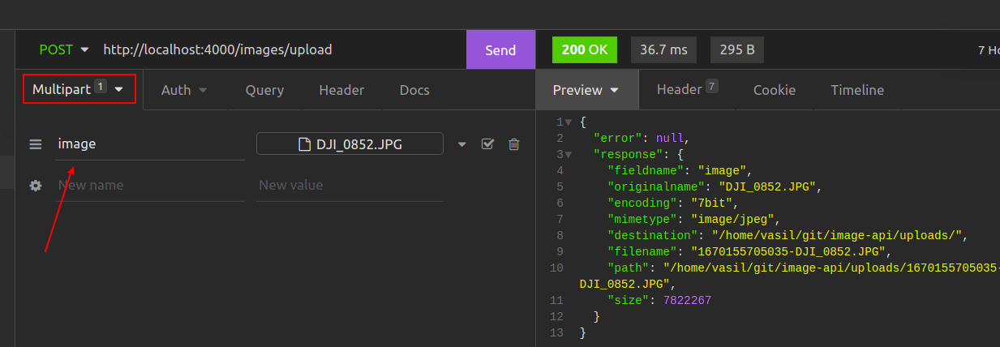
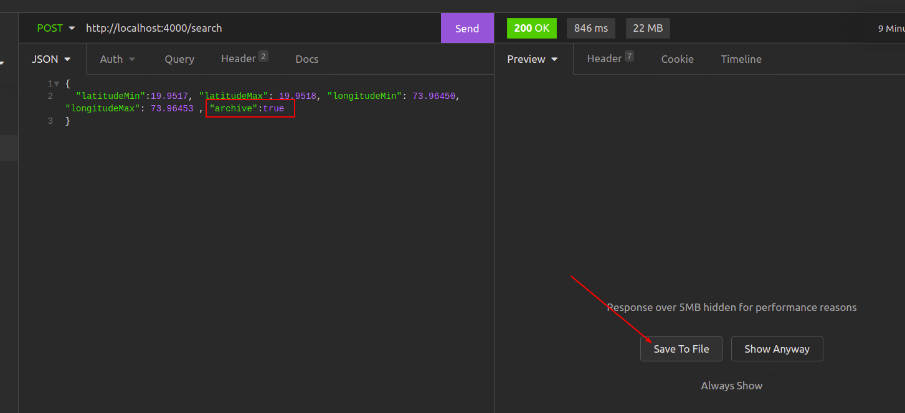

## Images API

### MYX back-end task

Rest API that organizes work with photos. It has the following main functionalities:

1. uploading photos, during this process is created a thumbnail, the longitude and latitude GPS coordinates of the photo are recognized from meta EXIF information parameters
2. search by specified criteria with the option to download all photos in a zip file or to receive only the paths to them
3. delete photo, the path to it is received as a response from the search method

### Installation and Running

Requires a working MongoDB on port 27017

<b>to install</b>

```bash
yarn install
```

in case using npm

```bash
npm install
```

check if folder "uploads" exists in project directory, if not please create it using

```bash
cd images-api
mkdir uploads
```

<b>to run </b>

```bash
yarn start
```

in case using npm

```bash
npm run start
```

Application will run on port 4000 !

### Dependencies

- MongoDB json collection to handle information about uploaded pictures
- multer to handle multipart/form-data by uploading files
- sharp transforming pictures to thumbnails
- adm-zip to make zip archive from pictures and send it back via API without saving to server
- exifr to read EXIF information from uploaded pictures

### Examples

1.<b> Upload picture</b>
post request to http://localhost:4000/upload <br>
use multipart/form data encoding, the key should be named 'image' <br>


successfully response: <br>
status - 200

```json
{
  "info": {
    "response": {
      "fieldname": "image",
      "originalname": "DJI_0852.JPG",
      "encoding": "7bit",
      "mimetype": "image/jpeg",
      "destination": "/home/vasil/git/image-api/uploads/",
      "filename": "1670155705035-DJI_0852.JPG",
      "path": "/home/vasil/git/image-api/uploads/1670155705035-DJI_0852.JPG",
      "size": 7822267
    }
  }
}
```

if image with the same name already exists receive response <br>
status - 400

```json
{
  "error": "Image with name 1 (14).JPG already exists"
}
```

if it is a problem during image manipulation
status - 500

```json
{ "error": "Error during uploading process" }
```

2. <b>Search and retrieve pictures</b>
   post request to http://localhost:4000/search <br>
   Content-Type - application/json <br>
   <b>parameters in body request:</b> <br>

- latitudeMin - number optional,
- latitudeMax - number optional,
- longitudeMin - number optional,
- longitudeMax - number optional,
  > if you don't send any of the above parameters you will get a response for all records
- archive - boolean if is set to true receive zipped file with all images in it, if is set to false, receive an array of images paths

response staus if image doesn't exists - 404 <br>

```json
{ "error": "No images found" }
```

successfully response status - 200

- this request will initialized searching by latitude and will send all founded images as archive in zip format

```json
{
  "latitudeMin": 19.9517,
  "latitudeMax": 19.9518,
  "archive": true
}
```

- this request will searched by latitude and longitude and will return array of paths to images
  request:

```json
{
  "latitudeMin": 19.9517,
  "latitudeMax": 19.9518,
  "longitudeMin": 73.9645,
  "longitudeMax": 73.96453,
  "archive": false
}
```

response:
status - 200

```json
{
  "fileNames": [
    "1670155698465-DJI_0848.JPG",
    "thumb-1670155698465-DJI_0848.JPG",
    "1670155705035-DJI_0852.JPG",
    "thumb-1670155705035-DJI_0852.JPG",
    "1670189886898-DJI_0847.JPG",
    "thumb-1670189886898-DJI_0847.JPG"
  ]
}
```

- this request will return all saved images in zip archive

```json
{
  "archive": true
}
```

status - 200
when "archive: true" you will receive a response - one zip file that will be contained all images and their thumbnails


3.<b> Delete picture</b>
delete request to http://localhost:4000/delete <br>
Content-Type - application/json <br>

- request

```json
{ "name": "1670150531413-DJI_0845.JPG" }
```

successfully response: <br>
status - 200

```json
{
  "message": "File 1670150531413-DJI_0845.JPG is deleted."
}
```

successfully response: <br>
status - 400

```json
{
  "message": "Image 1670150531413-DJI_08451.JPG not exists"
}
```

error during delete: <br>
status - 500

```json
{ "error": "Could not delete file Image 1670150531413-DJI_08451.JPG" }
```

### Regarding issues related to the network load and the possible future load of the database can offer the following architectural solutions:

1. In cases where the database becomes too large, sharding clusters can be made. Sharding is a method for distributing data across multiple machines. MongoDB uses sharding to support very large data sets. Sharding will improve response time, avoid service outage and scale efficiently - it is possible to add new shards at runtime without shutting down the application for maintenance.

2. If the traffic to the server becomes too much, a load balancer can be used to distributes a incoming network traffic between server pool.
   A load balancer is sitting in front of application servers and routing client requests across all servers capable of fulfilling those requests in a manner that maximizes speed and capacity utilization.
